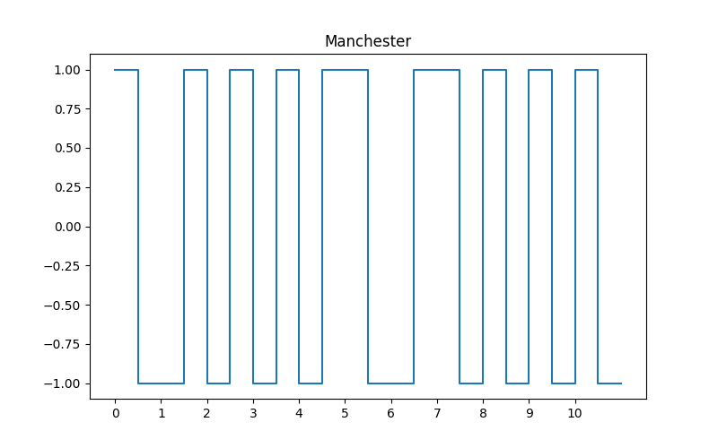

Iine code characteristics
====

Line coding is the process of converting digital data to digital signals. We can roughly divide line coding schemes into five broad categories
including:

    unipolar: all the signal levels are on one side of the time axis, either above or below like NRZ

    polar: the voltages are on the both sides of the time axis like NRZI, NRZM, RZ, manchester , differential manchster

    bipolar :three levels like Pseudoternary and AMI(not included in the repo)
    
    Multilevel: not included in this project
    
    Multitransition: not included in this project

> A self-synchronizing digital signal includes timing information in the data being
transmitted. This can be achieved if there are transitions in the signal that alert the
receiver to the beginning, middle, or end of the pulse. 

Line Codes
----

## NRZ

NRZ (Non-Return-to-Zero) Traditionally, a unipolar scheme was designed as a non-return-to-zero (NRZ) scheme, in which the positive voltage defines bit 1 and the zero voltage defines bit 0. It is called NRZ because the signal does not return to zero at the middle of the bit.

In polar NRZ encoding, we use two levels of voltage amplitude. We can have two versions of polar NRZ, NRZ-I Land NRZ- L.
The synchronization problem exists in both schemes

101000110 encoded in NRZ with V=5.

## NRZL:
1 is represented by one physical level (usually a positive voltage), while 0 is represented by another level (usually a negative voltage).

101000110 encoded in NRZL with V=5.

## NRZI:

Distinguishes data bits by the presence or absence of a transition at a clock boundary. 
a transition can be both encoded as logical 1 or 0.
each convention is possible. the former is NRZM(NRZ mark) and the latter is NRZS(NRZ space).

101000110 encoded in NRZI with V=1.

## Manchester
Manchester The idea of transition at
the middle of the bit(RZ) and the idea of NRZ-L are combined into the Manchester scheme.

10000101111 encoded in manchester with V=1.

some other ways to calculate mancher:
-  0 WILL BE LOW_HIGH AND 1 WILL BE HIGH_lOW.

- xoring data with the clock(double the data rate).

## Differential Manchester: 

combines the ideas of RZ and NRZ-I. **There is always a transition atthe middle of the bit**, but the bit values are determined at the beginning of the bit. If the**next bit is 0, there is a transition; if the next bit is 1, there is none**.

10000101111 encoded in differential manchester with V=1.

The signal rate for Manchester and differential Manchester is double that for NRZ.

